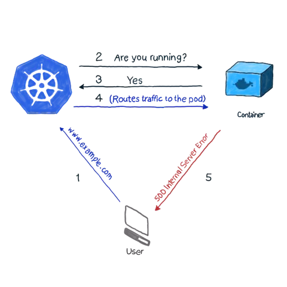

# Chapter 2: Pod Object

## Pod là cái qq gì ?

Pod là thành phần cơ bản nhất để cho mình deploy cái app của mình lên đó, Pod được tạo và quản lý bởi K.

Ủa mình có thể chạy container trực tiếp mà ?
cần méo gì củ lol Pod này cho phức tạp ta ?

Thực ra thì thằng pod này sinh ra, giống như wrapper tụi container lại với nhau, Cung cấp thêm nhiều chức năng hay cho cho việc quản lý container: Group tài nguyên of container, Check container còn healthy không, nếu die rồi thì restart lại, cung cấp lifecycle(thêm action khi pod chạy or shutdown). K sẽ quản lý P, thay vì quản lý trực tiếp C.

### Phân chia tài nguyên của kubernetes cluster bằng cách sử dụng namespace

Namespace dùng để phân chia tài nguyên giữa các môi trường dự án khác nhau, nó chia single K cluster thành nhiều sub cluster khác nhau(virtual cluster).

- Namespace dùng để làm gì:

  - Tạo ra các môi trường làm việc độc lập nếu có nhiều dự án, nhiều team, nhiều môi trường(dev, testing, staging...)
  - Phân bổ tài nguyên cho các môi trường: resource limits and quotas
  - Role-base access control: Admin sẽ thiết lập ai được phép access vào namespace

- Các namespace được tạo sẵn :

  - default: các tài nguyên mà không chỉ định namespace thì sẽ đẩy vào đây. (nhìn tao xem có giống cái sọt rác không)
  - kube-system: là namespace chứa các tài nguyên là các thành phần chính của một cụm Kubernetes cluster, được tạo bởi Kubernetes system. Namespace này chứa các tài nguyên hệ thống quan trọng, vì vậy, khi sử dụng cụm, nên giữ cho namespace này chạy độc, tách biệt với các service và ứng dụng riêng của chúng ta.
  - kube-public: Namespace này được tạo tự động khi cài đặt cụm và được Kubernetes quy ước là một namespace chứa các tài nguyên public có thể truy cập công khai trong toàn bộ cụm. Thực tế, thông thường, kube-public không được sử dụng nhiều.
  - kube-node-lease: Kể từ Kubernetes version 1.13, tính năng cho thuê node được giới thiệu là một tính năng alpha (NodeLease). Khi tính năng NodeLease được bật, mỗi node sẽ có một đối tượng Lease được liên kết trong namespace kube-node-lease, namespace được làm mới định kì, node lease được coi như tín hiệu từ node. Các node lease được làm mới thường xuyên và node lease nhẹ hơn nhiều so với NodeStatus (được sử dụng ở các version trước 1.13) nên tính năng này làm cho tín hiệu của node trở nên rẻ hơn đáng kể từ cả hai khía cạnh là khả năng mở rộng và hiệu suất.

Cách tạo ra một namespace của mình

```
k create namespace testing
```

```
apiVersion: v1
kind: Namespace
metadata:
  name: testing
```

<p align="center">
  
</p>

<p align="center">

| Tên viết tắt | Ý nghĩa    |
| ------------ | ---------- |
| K            | Kubernetes |
| P            | Pod        |
| C            | Containers |

</p>

## References

1. [Pod](https://viblo.asia/p/kubernetes-series-bai-2-kubernetes-pod-thanh-phan-de-chay-container-YWOZr3QElQ0)
2. [Namespace](https://viblo.asia/p/kubernetes-hoc-cach-su-dung-kubernetes-namespace-co-ban-ByEZkM845Q0)
